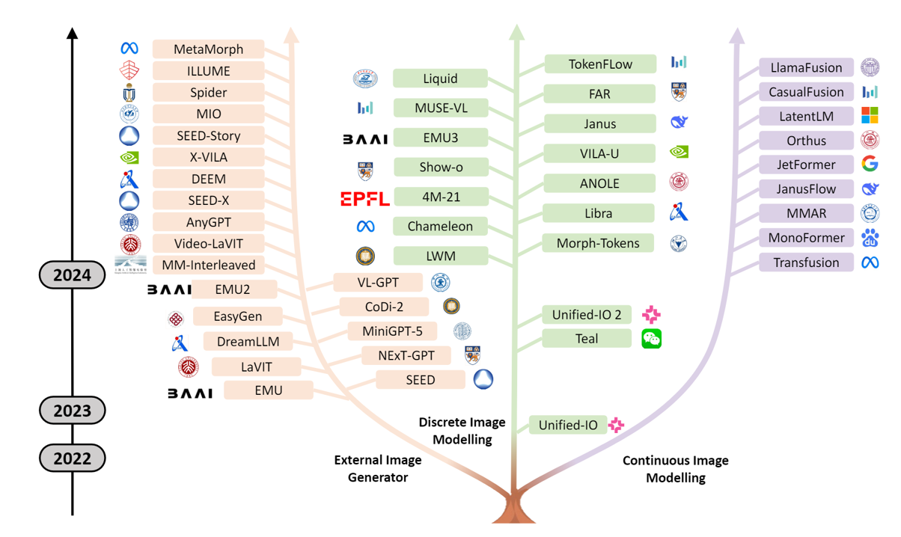

# Native Multimodal Models for Vision Language Understanding and Generation

[Chunjiang Ge](https://john-ge.github.io/)
[Mingyang Han](https://github.com/Mingyang-Han)

    <!-- 
    
    
     -->
    
    

## Introduction

The unification of different deep learning architectures and tasks has reshaped various fields. The standardization of natural language processing via Large Language Models have revenlotionized NLP. This progress raises a critical question: <strong>Can we seamlessly integrate vision and language understanding with generation?</strong> Emerging native multimodal models like Gemini and GPT-4o demonstrate early successes in bridging these capabilities. While architectures for LLMs and vision-language models (e.g., LLaVA, Qwen-VL) show signs of convergence, vision generation remains fragmented across three paradigms: discrete autoregressive models, continuous diffusion models, and flow matching. This divergence highlights fundamental challenges in unifying multimodal understanding and generation. We systematically analyze existing approaches to identify optimal pathways for building truly unified multimodal architectures. We categoried these unified models into three approaches via the visual generation method: visual generation through external generator, discrete and continuous modeling.

    
    
Taxonomy of Unified Models

## Benchmark Results

### Understanding

| Model          | Params | POPE | MME-P  | MMB_dev | SEED | VQAv2 | GQA   | MMMU | MM-Vet | TextVQA | MMStar |
| -------------- | ------ | ---- | ------ | ------- | ---- | ----- | ----- | ---- | ------ | ------- | ------ |
| LWM            |        | 75.2 | -      | -       | -    | 55.8  | 44.8  | 26.3 | 9.6    | 18.8    | -      |
| Unified-IO2    | 6.8B   | -    | -      | 71.5    | -    | -     | -     | 86.2 | -      | -       | 61.8   |
| LaVIT          | 7B     | -    | -      | -       | -    | 66.0  | 46.8  | -    | -      | -       | -      |
| Emu            | 13B    | -    | -      | -       | -    | 52.0  | -     | -    | -      | -       | -      |
| Emu2           | 37B    | -    | 1345   | 63.6    | -    | 84.9  | 65.1  | 34.1 | 48.5   | 66.6    | -      |
| Emu3           | 8B     | 85.2 | 1243.8 | 58.5    | 68.2 | 75.1  | 60.3  | 31.6 | -      | 64.7    | -      |
| SEEDLLaMA-I    | 8B     | -    | -      | 45.8    | 51.5 | 66.2  | -     | -    | -      | -       | 31.7   |
| SEED-X         | 17B    | 84.1 | 1457.0 | 70.1    | 66.5 | 71.2  | 49.1  | 35.6 | 43.0   | XXXXX   | -      |
| Janus          | 1.3B   | 87.0 | 1338.0 | 69.4    | 63.7 | 77.3  | 59.1  | 30.5 | 34.3   | -       | -      |
| JanusFlow      | 1.3B   | 88.0 | 1333.1 | 74.9    | 70.5 | 79.8  | 60.3  | 29.3 | 30.9   | -       | -      |
| Janus-Pro      | 1.5B   | 86.2 | 1444.0 | 75.5    | 68.3 | -     | 59.3  | 36.3 | 39.8   | -       | -      |
| Janus-Pro      | 7B     | 87.4 | 1567.1 | 79.2    | 72.1 | -     | 62.0  | 41.0 | 50.0   | -       | -      |
| NExT-GPT       | 13B    | -    | -      | -       | -    | 66.7  | -     | -    | -      | -       | -      |
| MUSE-VL        | 7B     | -    | 1480.9 | 72.1    | 70.0 | -     | -     | 42.3 | -      | -       | 48.3   |
| MUSE-VL        | 32B    | -    | 1581.6 | 81.8    | 71.0 | -     | -     | 50.1 | -      | -       | 56.7   |
| Libra          | 11.3B  | 88.2 | 1494.7 | 65.2    | 62.7 | 77.3  | 63.8  | -    | 31.8   | -       | -      |
| TokenFLow-XL   | 14B    | 87.8 | -      | 76.8    | 72.6 | 77.6  | 62.5  | 43.2 | -      | 62.3    | -      |
| QLIP           | 7B     | 86.1 | 1498.3 | -       | -    | 78.3  | 61.8  | -    | 33.3   | 55.2    | -      |
| UniTok         | 7B     | 83.2 | 1448   | -       | -    | 76.8  | 61.1  | -    | 33.9   | 51.6    | -      |
| DualToken      | 3B     | 86.0 | 1489.2 | 70.9    | 70.2 | 77.8  | -     | 38.6 | 32.5   | -       | -      |
| Liquid         | 7B     | 81.1 | 1119.3 | -       | -    | 71.3  | 58.4  | -    | -      | 42.4    | -      |
| SynerGen-VL    | 2.4B   | 85.3 | 1837   | 53.7    | 62.0 | -     | 59.7  | 34.2 | 34.5   | 67.5    | -      |
| AnyGPT         | 7B     | -    | -      | -       | -    | -     | -     | -    | -      | XXXXX   | -      |
| MIO-Instruct   | 7B     | -    | -      | -       | 54.4 | 65.5  | -     | -    | -      | XXXXX   | -      |
| ILLUME         | 7B     | 88.5 | 1445.3 | 75.1    | 72.9 | 66.2  | -     | 38.2 | 37.0   | 72.1    | 31.7   |
| VL-GPT         | 7B     | -    | -      | -       | -    | 67.2  | 51.5  | -    | -      | XXXXX   | -      |
| MM-Interleaved | 13B    | -    | -      | -       | -    | 80.2  | 60.5  | -    | -      | 61.0    | -      |
| Gemini-Nano-1  | 1.8B   | -    | -      | -       | -    | 62.7  | -     | 26.3 | -      | -       | -      |
| EasyGen        | 7B     | -    | -      | -       | -    | -     | 44.6  | -    | -      | XXXXX   | -      |
| DreamLLM       | 7B     | -    | -      | 58.2    | -    | 72.9  | -     | -    | 36.6   | -       | -      |
| DEEM-VQA       | 7B     | -    | -      | 60.8    | -    | 68.2  | 55.7  | -    | 37.4   | XXXXX   | -      |
| X-VILA         | 7B     | -    | -      | -       | -    | 72.9  | -     | 33.9 | -      | XXXXX   | -      |
| MetaMorph      | 8B     | -    | -      | 75.2    | 71.8 | -     | -     | 41.8 | -      | 60.5    | 44.0   | 
| VILA-U         | 7B     | 85.8 | 1401.8 | -       | 59.0 | 79.4  | 60.8  | -    | 33.5   | -       | -      |
| Chameleon      | 7B     | -    | 170.0  | 31.1    | 30.6 | -     | -     | 25.4 | 8.3    | -       | 31.1   |
| Chameleon      | 30B    | -    | 575.3  | 32.5    | 48.5 | -     | -     | 38.8 | -      | -       | 31.8   |
| Video-LaVIT    | 7B     | -    | 1551.8 | 67.3    | 64.0 | -     | -     | -    | -      | -       | -      |
| Show-o         | 1.3B   | 84.5 | 1232.9 | -       | -    | 74.7  | 61.0  | 27.4 | -      | -       | -      |
| HermesFlow     | 1.3B   | 81.4 | 1249.7 | -       | -    | 75.3  | 61.7  | 28.3 | -      | -       | -      |
| Orthus         | 7B     | 79.6 | 1265.8 | -       | -    | 63.2  | 52.8  | 28.2 | -      | -       | -      |
| Liquid†        | 7B     | 81.1 | 1119.3 | -       | -    | 71.3* | 58.4* | -    | -      | 42.4    | -      |
| D-DiT          | 2B     | 84.0 | 1124.7 | -       | -    | 60.1  | 59.2  | -    | -      | -       | -      |
| MMAR           | 7B     | 83.0 | 1393.9 | 66.32   | 64.5 | -     | -     | -    | 27.8   | -       | -      |
| LLaMAFusion    | 8B     | -    | 1603.7 | -       | -    | -     | -     | 41.7 | -      | -       | -      |
| OmniMamba      | 1.3B   | 86.3 | 1290.6 | -       | -    | 77.7  | 60.8  | 30.6 | -      | -       | -      |
| ILLUME+        | 3B     | 87.6 | 1414.0 | 80.8    | 73.3 | -     | -     | 44.3 | 40.3   | 69.9    | -      |
| MetaQuery-XL   | 7B     | -    | 1685.2 | 83.5    | 76.9 | -     | -     | 58.6 | 66.6   | -       | -      |
| VARGPT         | 7B     | 87.3 | 1488.8 | 67.6    | 67.9 | 78.4  | 62.3  | 36.4 | -      | 54.1    | -      |
| VARGPT-v1.1    | 7B     | 89.1 | 1684.1 | 81.01   | 76.0 | 80.4  | 66.2  | 48.5 | -      | 82.0    | -      |

### MJHQ-30K

| Method              | Resolution | Params | #Images | FID   |
| ------------------- | ---------- | ------ | ------- | ----- |
| **Generation Only** |                                       |
| SD-XL               |            | -      | 2000M   | 9.55  |
| PixArt              |            | -      | 25M     | 6.14  |
| Playground v2.5     |            | -      | -       | 4.48  |
| **Unified Model**   |                                       |
| LWM                 |            | 7B     | -       | 17.77 |
| Show-o              |            | 1.3B   | 36M     | 15.18 |
| JanusFlow           |            | 1.3B   | -       | 9.51  |
| MUSE-VL             | 256        | 7B     | 30K     | 7.73  |
| Janus               |            | 1.3B   | -       | 10.10 |
| VILA-U              | 256        | 7B     | 15M     | 12.81 |
| VILA-U              | 384        | 7B     | 15M     | 7.69  |
| SynerGen-VL         |            | 2.4B   | 30K     | 6.10  |
| Liquid              | 512        | 7B     | 30M     | 5.47  |
| ILLUME              |            | 7B     | 30K     | 7.76  |
| ILLUME+             |            | 3B     | 30K     | 6.00  |
| MetaQuery-XL        |            | 7B     | 30K     | 6.02  |

### GenEval Bench

| Model                | Params | Res. | Single Obj. | Two Obj. | Count. | Colors | Position | Color Attri. | Overall↑ |
| -------------------- | ------ | ---- | ----------- | -------- | ------ | ------ | -------- | ------------ | -------- |
| **Generation Model** |                                                                                               |
| LlamaGen             | 0.8B   | -    | 0.71        | 0.34     | 0.21   | 0.58   | 0.07     | 0.04         | 0.32     |
| LDM                  | 1.4B   | -    | 0.92        | 0.29     | 0.23   | 0.70   | 0.02     | 0.05         | 0.37     |
| PixArt-α             | 0.6B   | -    | 0.98        | 0.50     | 0.44   | 0.80   | 0.08     | 0.07         | 0.48     |
| VAR                  | -      | 256  | -           | -        | -      | -      | -        | -            | 0.53     |
| Emu3-Gen             | 8B     | -    | 0.98        | 0.71     | 0.34   | 0.81   | 0.17     | 0.21         | 0.54     |
| SDv1.5               | 0.9B   | -    | 0.97        | 0.38     | 0.35   | 0.76   | 0.04     | 0.06         | 0.43     |
| SDv2.1               | 0.9B   | -    | 0.98        | 0.51     | 0.44   | 0.85   | 0.07     | 0.17         | 0.50     |
| SDXL                 | 2.6B   | -    | 0.98        | 0.74     | 0.39   | 0.85   | 0.15     | 0.23         | 0.55     |
| SD3                  | 2B     | -    | 0.98        | 0.74     | 0.63   | 0.67   | 0.34     | 0.36         | 0.62     |
| IF-XL                | 4.3B   | -    | 0.97        | 0.74     | 0.66   | 0.81   | 0.13     | 0.35         | 0.61     |
| DALL-E 2             | 6.5B   | -    | 0.94        | 0.66     | 0.49   | 0.77   | 0.10     | 0.19         | 0.52     |
| DALL-E 3             | -      | -    | 0.96        | 0.87     | 0.47   | 0.83   | 0.43     | 0.45         | 0.67     |
| **Unified Model**    |                                                                                               |
| CODI                 | -      | -    | 0.89        | 0.16     | 0.16   | 0.65   | 0.02     | 0.01         | 0.31     |
| BSQViT               | -      | -    | -           | -        | -      | -      | -        | -            | 0.31     |
| Chameleon            | 34B    | -    | -           | -        | -      | -      | -        | -            | 0.39     |
| LWM                  | 7B     | -    | 0.93        | 0.41     | 0.46   | 0.79   | 0.09     | 0.15         | 0.47     |
| QLIP                 | 7B     | -    | -           | -        | -      | -      | -        | -            | 0.48     |
| SEED-X               | 17B    | -    | 0.97        | 0.58     | 0.26   | 0.80   | 0.19     | 0.14         | 0.49     |
| MUSE-VL              | 7B     | 256  | -           | -        | -      | -      | -        | -            | 0.53     |
| TokenFLow            | 13B    | 256  | -           | -        | -      | -      | -        | -            | 0.55     |
| Orthus               | 7B     | 512  | 0.99        | 0.75     | 0.26   | 0.84   | 0.28     | 0.38         | 0.58     |
| SynerGen-VL          | 2.4B   | -    | 0.99        | 0.71     | 0.34   | 0.87   | 0.37     | 0.37         | 0.61     |
| ILLUME               | 7B     | -    | 0.99        | 0.86     | 0.45   | 0.71   | 0.39     | 0.28         | 0.61     |
| ILLUME+              | 3B     | -    | 0.99        | 0.88     | 0.62   | 0.84   | 0.42     | 0.53         | 0.72     |
| Emu3-Gen             | 8B     | -    | 0.98        | 0.71     | 0.34   | 0.87   | 0.37     | 0.37         | 0.61     |
| Transfusion          | -      | 256  | -           | -        | -      | -      | -        | -            | 0.63     |
| D-DiT                | 2B     | -    | 0.97        | 0.80     | 0.54   | 0.76   | 0.32     | 0.50         | 0.65     |
| Show-o               | 1.3B   | -    | 0.98        | 0.80     | 0.66   | 0.84   | 0.31     | 0.50         | 0.68     |
| HermesFlow           | 1.3B   | -    | 0.98        | 0.84     | 0.66   | 0.82   | 0.32     | 0.52         | 0.69     |
| Janus                | 1.3B   | -    | 0.97        | 0.68     | 0.30   | 0.84   | 0.46     | 0.42         | 0.61     |
| JanusFlow            | 1.3B   | -    | 0.97        | 0.59     | 0.45   | 0.83   | 0.53     | 0.42         | 0.63     |
| Janus-Pro            | 1.5B   | -    | 0.98        | 0.82     | 0.51   | 0.89   | 0.65     | 0.56         | 0.73     |
| Janus-Pro            | 7B     | -    | 0.99        | 0.89     | 0.59   | 0.90   | 0.79     | 0.66         | 0.80     |
| MetaQuery-XL         | 7B     | -    | -           | -        | -      | -      | -        | -            | 0.80     |
| VARGPT-v1.1          | 7B     | -    | 0.96        | 0.53     | 0.48   | 0.83   | 0.13     | 0.21         | 0.53     |

## Image Tokenizer

### Discrete Encoder/VQ
| Publication Date | Method Abbreviation | Full Title                                                                                                                | arXiv Link                                | Code Repository                                                              |
| ---------------- | ------------------- | ------------------------------------------------------------------------------------------------------------------------- | ----------------------------------------- | ---------------------------------------------------------------------------- |
| 17/11            | VQ-VAE              | Neural Discrete Representation Learning                                                                                   | [arXiv](https://arxiv.org/pdf/1711.00937) |                                                                              |
| 19/06            | VQ-VAE-2            | Generating Diverse High-Fidelity Images with VQ-VAE-2                                                                     | [arXiv](https://arxiv.org/pdf/1906.00446) |                                                                              |
| 20/12            | VQGAN               | Taming Transformers for High-Resolution Image Synthesis                                                                   | [arXiv](https://arxiv.org/abs/2012.09841) | [GitHub](https://github.com/CompVis/taming-transformers)                     |
| 21/10            | ViT-VQGAN           | VECTOR-QUANTIZED IMAGE MODELING WITH IMPROVED VQGAN                                                                       | [arXiv](https://arxiv.org/pdf/2110.04627) |                                                                              |
| 22/02            | MaskGIT             | MaskGIT: Masked Generative Image Transformer                                                                              | [arXiv](https://arxiv.org/pdf/2202.04200) |                                                                              |
| 22/09            | MoVQ                | MoVQ: Modulating Quantized Vectors for High-Fidelity Image Generation                                                     | [arXiv](https://arxiv.org/pdf/2209.09002) |                                                                              |
| 22/12            | MAGVIT              | MAGVIT: Masked Generative Video Transformer                                                                               | [arXiv](https://arxiv.org/pdf/2212.05199) | [GitHub](https://github.com/google-research/magvit)                          |
| 23/10            | Efficient-VQGAN     | Efficient-VQGAN: Towards High-Resolution Image Generation with Efficient Vision Transformers                              | [arXiv](https://arxiv.org/pdf/2310.05400) |                                                                              |
| 24/03            | UniCode             | UniCode: Learning a Unified Codebook for Multimodal Large Language Models                                                 | [arXiv](https://arxiv.org/pdf/2403.09072) |                                                                              |
| 24/05            | Chameleon           | Chameleon: Mixed-Modal Early-Fusion Foundation Models                                                                     | [arXiv](https://arxiv.org/abs/2405.09818) | [GitHub](https://github.com/facebookresearch/chameleon)                      |
| 24/05            | LG-VQ               | LG-VQ: Language-Guided Codebook Learning                                                                                  | [arXiv](https://arxiv.org/abs/2405.14206) |                                                                              |
| 24/06            | LlamaGEN            | Autoregressive Model Beats Diffusion: Llama for Scalable Image Generation                                                 | [arXiv](https://arxiv.org/pdf/2406.06525) | [GitHub](https://github.com/FoundationVision/LlamaGen)                       |
| 24/06            | TiTok               | An Image is Worth 32 Tokens for Reconstruction and Generation                                                             | [arXiv](https://arxiv.org/abs/2406.07550) | [GitHub](https://github.com/bytedance/1d-tokenizer)                          |
| 24/06            | OmniTokenizer-VQVAE | OmniTokenizer: A Joint Image-Video Tokenizer for Visual Generation                                                        | [arXiv](https://arxiv.org/abs/2406.09399) | [GitHub](https://github.com/FoundationVision/OmniTokenizer)                  |
| 24/06            | VQGAN-LC            | Scaling the Codebook Size of VQGAN to 100,000 with a Utilization Rate of 99%                                              | [arXiv](https://arxiv.org/abs/2406.11837) |                                                                              |
| 24/09            | MaskBit             | MaskBit: Embedding-free Image Generation via Bit Tokens                                                                   | [arXiv](https://arxiv.org/abs/2409.16211) | [GitHub](https://github.com/markweberdev/maskbit)                            |
| 24/10            | BPE-VQ              | From Pixels to Tokens: Byte-Pair Encoding on Quantized Visual Modalities                                                  | [arXiv](https://arxiv.org/abs/2410.02155) |                                                                              |
| 24/10            | RotationTrick       | RESTRUCTURING VECTOR QUANTIZATION WITH THE ROTATION TRICK                                                                 | [arXiv](https://arxiv.org/abs/2410.06424) | [GitHub](https://github.com/cfifty/rotation_trick)                           |
| 24/10            | DiGIT               | Stabilize the Latent Space for Image Autoregressive Modeling: A Unified Perspective                                       | [arXiv](https://arxiv.org/abs/2410.12490) | [GitHub](https://github.com/DAMO-NLP-SG/DiGIT)                               |
| 24/11            | SimVQ               | ADDRESSING REPRESENTATION COLLAPSE IN VECTOR QUANTIZED MODELS WITH ONE LINEAR LAYER                                       | [arXiv](https://arxiv.org/abs/2411.02038) | [GitHub](https://github.com/youngsheen/SimVQ)                                |
| 24/11            | ALIT                | ADAPTIVE LENGTH IMAGE TOKENIZATION VIA RECURRENT ALLOCATION                                                               | [arXiv](https://arxiv.org/abs/2411.02393) | [GitHub](https://github.com/ShivamDuggal4/adaptive-length-tokenizer)         |
| 24/11            | VQ-KD               | Image Understanding Makes for A Good Tokenizer for Image Generation                                                       | [arXiv](https://arxiv.org/abs/2411.04406) | [GitHub](https://github.com/magic-research/vector_quantization)              |
| 24/11            | FQGAN               | Factorized Visual Tokenization and Generation                                                                             | [arXiv](https://arxiv.org/abs/2411.16681) | [GitHub](https://github.com/showlab/FQGAN)                                   |
| 24/12            | TokenFlow           | TokenFlow: Unified Image Tokenizer for Multimodal Understanding and Generation                                            | [arXiv](https://arxiv.org/abs/2412.03069) | [GitHub](https://github.com/ByteFlow-AI/TokenFlow)                           |
| 24/12            | SynerGen-VL         | SynerGen-VL: Towards Synergistic Image Understanding and Generation with Vision Experts and Token Folding                 | [arXiv](https://arxiv.org/abs/2412.09604) |                                                                              |
| 24/12            | SoftVQ-VAE          | SoftVQ-VAE: Efficient 1-Dimensional Continuous Tokenizer                                                                  | [arXiv](https://arxiv.org/abs/2412.10958) | [GitHub](https://github.com/Hhhhhhao/continuous_tokenizer)                   |
| 24/12            | CRT                 | When Worse is Better: Navigating the compression-generation tradeoff in visual tokenization                               | [arXiv](https://arxiv.org/abs/2412.16326) |                                                                              |
| 24/12            | IBQ                 | Scalable Image Tokenization with Index Backpropagation Quantization                                                       | [arXiv](https://arxiv.org/pdf/2412.02692) | [GitHub](https://github.com/TencentARC/SEED-Voken)                           |
| 25/01            | TA-TiTok            | Democratizing Text-to-Image Masked Generative Models with Compact Text-Aware One-Dimensional Tokens                       | [arXiv](https://arxiv.org/pdf/2501.07730) | [GitHub](https://github.com/bytedance/1d-tokenizer)                          |
| 25/01            | One-D-Piece         | One-D-Piece: Image Tokenizer Meets Quality-Controllable Compression                                                       | [arXiv](https://arxiv.org/pdf/2501.10064) | [GitHub](https://github.com/turingmotors/One-D-Piece)                        |
| 25/02            | UniTok              | UniTok: A Unified Tokenizer for Visual Generation and Understanding                                                       | [arXiv](https://arxiv.org/abs/2502.20321) | [GitHub](https://github.com/FoundationVision/UniTok)                         |
| 25/03            | SemHiTok            | SemHiTok: A Unified Image Tokenizer via Semantic-Guided Hierarchical Codebook for Multimodal Understanding and Generation | [arXiv](https://arxiv.org/abs/2503.06764) |                                                                              |
| 25/03            | V2Flow              | V2Flow: Unifying Visual Tokenization and Large Language Model Vocabularies for Autoregressive Image Generation            | [arXiv](https://arxiv.org/abs/2503.07493) | [GitHub](https://github.com/zhangguiwei610/V2Flow)                           |
| 25/03            | Robust Tokenizer    | Robust Latent Matters: Boosting Image Generation with Sampling Error                                                      | [arXiv](https://arxiv.org/abs/2503.08354) | [GitHub](https://github.com/lxa9867/ImageFolder)                             |
| 25/03            | PCA Tokenizer       | “Principal Components” Enable A New Language of Images                                                                    | [arXiv](https://arxiv.org/abs/2503.08685) | [GitHub](https://github.com/visual-gen/semanticist)                          |
| 25/03            | DualToken           | DualToken: Towards Unifying Visual Understanding and Generation with Dual Visual Vocabularies                             | [arXiv](https://arxiv.org/abs/2503.14324) | [GitHub](https://github.com/songweii/DualToken)                              |
| 25/03            | CTF                 | Improving Autoregressive Image Generation through Coarse-to-Fine Token Prediction                                         | [arXiv](https://arxiv.org/abs/2503.16194) | [GitHub](https://github.com/GzyAftermath/CTF)                                |
| 25/03            | TokenSet            | Tokenize Image as a Set                                                                                                   | [arXiv](https://arxiv.org/abs/2503.16425) | [GitHub](https://github.com/Gengzigang/TokenSet)                             |
| 25/03            | TokenBridge         | Bridging Continuous and Discrete Tokens for Autoregressive Visual Generation                                              | [arXiv](https://arxiv.org/abs/2503.16430) | [Project Page](https://yuqingwang1029.github.io/TokenBridge/)                |

### Discrete Encoder/RQ
| Publication Date | Method Abbreviation | Full Title                                                                                   | arXiv Link                                | Code Repository                                                              |
| ---------------- | ------------------- | -------------------------------------------------------------------------------------------- | ----------------------------------------- | ---------------------------------------------------------------------------- |
| 22/03            | RQ-VAE              | Autoregressive Image Generation using Residual Quantization                                  | [arXiv](https://arxiv.org/pdf/2203.01941) | [GitHub](https://github.com/kakaobrain/rq-vae-transformer)                   |
| 24/04            | VAR                 | Visual Autoregressive Modeling: Scalable Image Generation via Next-Scale Prediction          | [arXiv](https://arxiv.org/abs/2404.02905) | [GitHub](https://github.com/FoundationVision/VAR)                            |
| 25/03            | NFIG                | NFIG: Autoregressive Image Generation with Next-Frequency Prediction                         | [arXiv](https://arxiv.org/abs/2503.07076) |                                                                              |

### Discrete Encoder/FSQ
| Publication Date | Method Abbreviation | Full Title                                                                                   | arXiv Link                                | Code Repository                                                              |
| ---------------- | ------------------- | -------------------------------------------------------------------------------------------- | ----------------------------------------- | ---------------------------------------------------------------------------- |
| 23/09            | FSQ-VQ-VAE          | FINITE SCALAR QUANTIZATION: VQ-VAE MADE SIMPLE                                               | [arXiv](https://arxiv.org/pdf/2309.15505) | [GitHub](https://github.com/google-research/google-research/tree/master/fsq) |
| 24/10            | ElasticTok          | ELASTICTOK: ADAPTIVE TOKENIZATION FOR IMAGE AND VIDEO                                        | [arXiv](https://arxiv.org/pdf/2410.08368) | [GitHub](https://github.com/LargeWorldModel/ElasticTok)                      |
| 24/12            | VIDTOK              | VIDTOK: A VERSATILE AND OPEN-SOURCE VIDEO TOKENIZER                                          | [arXiv](https://arxiv.org/pdf/2412.13061) | [GitHub](https://github.com/microsoft/VidTok)                                |
| 25/02            | FlexTok             | FlexTok: Resampling Images into 1D Token Sequences of Flexible Length                        | [arXiv](https://arxiv.org/abs/2502.13967) |                                                                              |

### Discrete Encoder/LFQ
| Publication Date | Method Abbreviation | Full Title                                                                                    | arXiv Link                                | Code Repository                                                             |
| ---------------- | ------------------- | --------------------------------------------------------------------------------------------- | ----------------------------------------- | --------------------------------------------------------------------------- |
| 23/10            | MAGVIT-v2           | Language Model Beats Diffusion -- Tokenizer is Key to Visual Generation                       | [arXiv](https://arxiv.org/abs/2310.05737) |                                                                             |
| 24/05            | LIBRA               | Libra: Building Decoupled Vision System on Large Language Models                              | [arXiv](https://arxiv.org/abs/2405.10140) | [GitHub](https://github.com/YifanXu74/Libra)                                |
| 24/09            | Open-MAGVIT2        | Open-MAGVIT2: An Open-Source Project Toward Democratizing Auto-regressive Visual Generation   | [arXiv](https://arxiv.org/abs/2409.04410) | [GitHub](https://github.com/TencentARC/SEED-Voken)                          |
| 25/03            | FlowMo              | Flow to the Mode: Mode-Seeking Diffusion Autoencoders for State-of-the-Art Image Tokenization | [arXiv](https://arxiv.org/abs/2503.11056) | [Project Page](https://kylesargent.github.io/flowmo)                        |

### Discrete Encoder/BSQ
| Publication Date | Method Abbreviation | Full Title                                                                                             | arXiv Link                                | Code Repository                                                 |
| ---------------- | ------------------- | ------------------------------------------------------------------------------------------------------ | ----------------------------------------- | --------------------------------------------------------------- |
| 24/06            | BSQ-ViT             | Image and Video Tokenization with Binary Spherical Quantization                                        | [arXiv](https://arxiv.org/abs/2406.07548) | [GitHub](https://github.com/zhaoyue-zephyrus/bsq-vit)           |
| 25/02            | QLIP                | QLIP: Text-Aligned Visual Tokenization Unifies Auto-Regressive Multimodal Understanding and Generation | [arXiv](https://arxiv.org/abs/2502.05178) | [GitHub](https://github.com/NVlabs/QLIP)                        |

### Discrete Encoder/PQ
| Publication Date | Method Abbreviation | Full Title                                                                                   | arXiv Link                                | Code Repository                                                              |
| ---------------- | ------------------- | -------------------------------------------------------------------------------------------- | ----------------------------------------- | ---------------------------------------------------------------------------- |
| 24/10            | ImageFolder         | ImageFolder: Autoregressive Image Generation with Folded Tokens                              | [arXiv](https://arxiv.org/abs/2410.01756) | [GitHub](https://github.com/lxa9867/ImageFolder)                             |
| 24/12            | XQ-GAN              | XQ-GAN: An Open-source Image Tokenization Framework for Autoregressive Generation            | [arXiv](https://arxiv.org/abs/2412.01762) | [GitHub](https://github.com/lxa9867/ImageFolder)                             |

### Discrete Encoder/Other Methods
| Publication Date | Method Abbreviation | Full Title                                                                                   | arXiv Link                                | Code Repository                                                              |
| ---------------- | ------------------- | -------------------------------------------------------------------------------------------- | ----------------------------------------- | ---------------------------------------------------------------------------- |
| 24/12            | GSQ                 | Scaling Image Tokenizers with Grouped Spherical Quantization                                 | [arXiv](https://arxiv.org/abs/2412.02632) | [GitHub](https://github.com/HelmholtzAI-FZJ/flex_gen)                        |
| 24/12            | TexTok              | Language-Guided Image Tokenization for Generation                                            | [arXiv](https://arxiv.org/abs/2412.05796) | [GitHub](https://kaiwenzha.github.io/textok/)                                |
| 24/12            | SIT                 | Spectral Image Tokenizer                                                                     | [arXiv](https://arxiv.org/abs/2412.09607) |                                                                              |

### Continuous Encoder
| Publication Date | Method Abbreviation | Full Title                                                                                   | arXiv Link                                | Code Repository                                                              |
| ---------------- | ------------------- | -------------------------------------------------------------------------------------------- | ----------------------------------------- | ---------------------------------------------------------------------------- |
| 13/12            | VAE                 | Auto-Encoding Variational Bayes                                                              | [arXiv](https://arxiv.org/abs/2412.04432) |                                                                              |
| 24/12            | Divot               | Divot: Diffusion Powers Video Tokenizer for Comprehension and Generation                     | [arXiv](https://arxiv.org/abs/2412.04432) | [GitHub](https://github.com/TencentARC/Divot)                                |
| 25/01            | VA-VAE              | Reconstruction vs. Generation:Taming Optimization Dilemma in Latent Diffusion Models         | [arXiv](https://arxiv.org/abs/2501.01423) | [GitHub](https://github.com/hustvl/LightningDiT)                             |
| 25/01            | CAT                 | CAT: Content-Adaptive Image Tokenization                                                     | [arXiv](https://arxiv.org/abs/2501.03120) |                                                                              |
| 25/01            | ViTok               | Learnings from Scaling Visual Tokenizers for Reconstruction and Generation                   | [arXiv](https://arxiv.org/abs/2501.09755) | [Project Page](https://vitok.github.io)                                      |
| 25/02            | ReaLS               | Exploring Representation-Aligned Latent Space for Better Generation                          | [arXiv](https://arxiv.org/abs/2502.00359) | [GitHub](https://github.com/black-yt/ReaLS)                                  |
| 25/02            | MAETok              | Masked Autoencoders Are Effective Tokenizers for Diffusion Models                            | [arXiv](https://arxiv.org/abs/2502.03444) | [GitHub](https://github.com/Hhhhhhao/continuous_tokenizer)                   |
| 25/02            | EQ-VAE              | EQ-VAE: Equivariance Regularized Latent Space for Improved Generative Image Modeling         | [arXiv](https://arxiv.org/abs/2502.09509) | [GitHub](https://github.com/zelaki/eqvae)                                    |
| 25/03            | FAR                 | Frequency Autoregressive Image Generation with Continuous Tokens                             | [arXiv](https://arxiv.org/abs/2503.05305) | [GitHub](https://github.com/yuhuUSTC/FAR)                                    |
| 25/03            | USP                 | USP: Unified Self-Supervised Pretraining for Image Generation and Understanding              | [arXiv](https://arxiv.org/abs/2503.06132) | [GitHub](https://github.com/cxxgtxy/USP)                                     |
| 25/03            | TokenBridge         | Bridging Continuous and Discrete Tokens for Autoregressive Visual Generation                 | [arXiv](https://arxiv.org/abs/2503.16430) | [Project Page](https://yuqingwang1029.github.io/TokenBridge/)                |

### Text-Representation Encoder
| Publication Date | Method Abbreviation | Full Title                                                                                   | arXiv Link                                | Code Repository                                                              |
| ---------------- | ------------------- | -------------------------------------------------------------------------------------------- | ----------------------------------------- | ---------------------------------------------------------------------------- |
| 23/02            | LQAE                | Language Quantized AutoEncoders: Towards Unsupervised Text-Image Alignment                   | [arXiv](https://arxiv.org/abs/2302.00902) |                                                                              |
| 23/06            | SPAE                | SPAE: Semantic Pyramid AutoEncoder for Multimodal Generation with Frozen LLMs                | [arXiv](https://arxiv.org/abs/2306.17842) |                                                                              |
| 24/03            | V2L-Tokenizer       | Beyond Text: Frozen Large Language Models in Visual Signal Comprehension                     | [arXiv](https://arxiv.org/abs/2403.07874) | [GitHub](https://github.com/zh460045050/V2L-Tokenizer)                       |
| 24/12            | ViLex               | Visual Lexicon: Rich Image Features in Language Space                                        | [arXiv](https://arxiv.org/abs/2412.06774) |                                                                              |

## External Image Generator

### Discrete Condition

| Publication Date | Method Abbreviation | Full Title                                                                                | arXiv Link                                | Code Repository                                              |
| ---------------- | ------------------- | ----------------------------------------------------------------------------------------- | ----------------------------------------- | ------------------------------------------------------------ |
| 23/09            | LAViT               | Unified Language-Vision Pretraining in Llm With Dynamic Discrete Visual Tokenization      | [arXiv](https://arxiv.org/abs/2309.04669) | [GitHub](https://github.com/jy0205/LaVIT)                    |
| 23/10            | SEED                | Making Llama See and Draw With Seed Tokenizer                                             | [arXiv](https://arxiv.org/abs/2310.01218) | [GitHub](https://github.com/AILab-CVC/SEED/)                 |
| 24/02            | AnyGPT              | Anygpt: Unified Multimodal Llm With Discrete Sequence Modeling                            | [arXiv](https://arxiv.org/abs/2402.12226) | [GitHub](https://github.com/OpenMOSS/AnyGPT)                 |
| 24/09            | MIO                 | Mio: A Foundation Model on Multimodal Tokens                                              | [arXiv](https://arxiv.org/abs/2409.17692) | [GitHub](https://github.com/MIO-Team/MIO)                    |
| 24/12            | Illume              | Illume: Illuminating Your Llms to See, Draw, and Self-Enhance                             | [arXiv](https://arxiv.org/abs/2412.06673) | [GitHub](https://github.com/illume-project/illume)           |
| 25/04            | ILLUME+             | ILLUME+: Illuminating Unified MLLM with Dual Visual Tokenization and Diffusion Refinement | [arXiv](https://arxiv.org/abs/2504.01934) | [GitHub](https://github.com/illume-unified-mllm/ILLUME_plus) |

### Continuous Condition

| Publication Date | Method Abbreviation | Full Title                                                                                        | arXiv Link                                            | Code Repository                                         |
| ---------------- | ------------------- | ------------------------------------------------------------------------------------------------- | ----------------------------------------------------- | ------------------------------------------------------- |
| 23/07            | Emu                 | Emu: Generative Pretraining in Multimodality                                                      | [arXiv](https://arxiv.org/abs/2307.05222)             | [GitHub](https://github.com/baaivision/Emu)             |
| 23/09            | NExT-GPT            | Next-Gpt                                                                                          | [arXiv](https://arxiv.org/abs/2309.05519)             | [GitHub](https://github.com/NExT-GPT/NExT-GPT)          |
| 23/10            | MiniGPT-5           | Minigpt-5: Interleaved Vision-and-Language Generation Via Generative Vokens                       | [arXiv](https://arxiv.org/abs/2310.02239)             |                                                         |
| 23/12            | VL-GPT              | Vl-Gpt: A Generative Pre-Trained Transformer for Vision and Language Understanding and Generation | [arXiv](https://arxiv.org/abs/2312.09251)             | [GitHub](https://github.com/AILab-CVC/VL-GPT)           |
| 23/12            | Emu2                | Generative Multimodal Models Are In-Context Learners                                              | [arXiv](https://arxiv.org/abs/2312.13286)             | [GitHub](https://github.com/baaivision/Emu)             |
| 24/01            | MM-Interleaved      | Mm-Interleaved: Interleaved Image-Text Generative Modeling Via Multi-Modal Feature Synchronizer   | [arXiv](https://arxiv.org/abs/2401.10208)             | [GitHub](https://github.com/OpenGVLab/MM-Interleaved)   |
| 23/10            | EasyGen             | Easygen: Easing Multimodal Generation With Bidiffuser and Llms                                    | [arXiv](https://arxiv.org/abs/2310.08949)             |                                                         |
| 23/11            | CoDi-2              | Codi-2: In-Context Interleaved and Interactive Any-to-Any Generation                              | [arXiv](https://arxiv.org/abs/2311.18775)             |                                                         |
| 24/04            | SEED-X              | Seed-X: Multimodal Models With Unified Multi-Granularity Comprehension and Generation             | [arXiv](https://arxiv.org/abs/2404.14396)             | [GitHub](https://github.com/AILab-CVC/SEED-X)           |
| 23/09            | DreamLLM            | Dreamllm: Synergistic Multimodal Comprehension and Creation                                       | [arXiv](https://arxiv.org/abs/2309.11499)             | [GitHub](https://github.com/RunpeiDong/DreamLLM)        |
| 24/05            | DEEM                | Deem: Diffusion Models Serve as the Eyes of Large Language Models for Image Perception            | [arXiv](https://arxiv.org/abs/2405.15232)             | [GitHub](https://github.com/RainBowLuoCS/DEEM)          |
| 24/05            | X-VILA              | X-Vila: Cross-Modality Alignment for Large Language Model                                         | [arXiv](https://arxiv.org/abs/2405.19335)             |                                                         |
| 24/11            | Spider              | Spider: Any-to-Many Multimodal Llm                                                                | [arXiv](https://arxiv.org/abs/2411.09439)             |                                                         |
| 24/12            | MetaMorph           | Metamorph: Multimodal Understanding and Generation Via Instruction Tuning                         | [arXiv](https://arxiv.org/abs/2412.14164)             | [Project Page](https://tsb0601.github.io/metamorph/)    |
| 25/04            | MetaQuery           | Transfer between Modalities with MetaQueries                                                      | [arXiv](https://arxiv.org/abs/2504.06256)             | [Project Page](https://xichenpan.com/metaquery)         |

## Discrete Image Modelling

### VQGAN Encoder

| Publication Date | Method Abbreviation | Full Title                                                                                                | arXiv Link                                   | Code Repository                                                |
| ---------------- | ------------------- | --------------------------------------------------------------------------------------------------------- | -------------------------------------------- | -------------------------------------------------------------- |
| 22/02            | OFA                 | Ofa: Unifying Multimodal Pretrained Models                                                                | [arXiv](https://arxiv.org/abs/2202.03052)    | [GitHub](https://github.com/OFA-Sys/OFA)                       |
| 22/06            | Unified-IO          | Unified-Io: A Unified Model for Vision, Language, and Multi-Modal Tasks                                   | [arXiv](https://arxiv.org/abs/2206.08916)    | [GitHub](https://github.com/allenai/unified-io-2)              |
| 23/11            | Teal                | Teal: Tokenize and Embed All for Multi-Modal Large Language Models                                        | [arXiv](https://arxiv.org/abs/2311.04589)    |                                                                |
| 24/02            | LWM                 | World Model on Million-Length Video and Language With Ringattention                                       | [arXiv](https://arxiv.org/abs/2402.08268)    | [GitHub](https://github.com/LargeWorldModel/LWM)               |
| 24/05            | Chameleon           | Chameleon: Mixed-Modal Early-Fusion Foundation Models                                                     | [arXiv](https://arxiv.org/abs/2405.09818)    | [GitHub](https://github.com/facebookresearch/chameleon)        |
| 24/06            | LlamaGEN            | Autoregressive Model Beats Diffusion: Llama for Scalable Image Generation                                 | [arXiv](https://arxiv.org/abs/2406.06525)    | [GitHub](https://github.com/FoundationVision/LlamaGen)         |
| 24/06            | 4M-21               | 4M-21: An Any-to-Any Vision Model for Tens of Tasks and Modalities                                        | [arXiv](https://arxiv.org/abs/2406.09406)    |                                                                |
| 24/07            | ANOLE               | Anole: An Open, Autoregressive, Native Large Multimodal Models for Interleaved Image-Text Generation      | [arXiv](https://arxiv.org/abs/2407.06135)    | [GitHub](https://github.com/GAIR-NLP/anole)                    |
| 24/08            | Show-o              | Show-o: One single transformer to unify multimodal understanding and generation                           | [arXiv](https://arxiv.org/abs/2408.12528)    |                                                                |
| 24/09            | Emu3                | Emu3: Next-Token Prediction is All You Need                                                               | [arXiv](https://arxiv.org/abs/2409.18869)    |                                                                |
| 24/12            | Liquid              | Liquid: Language Models are Scalable Multi-modal Generators                                               | [arXiv](https://arxiv.org/abs/2412.04332)    |                                                                |
| 24/12            | SynerGen-VL         | SynerGen-VL: Towards Synergistic Image Understanding and Generation with Vision Experts and Token Folding | [arXiv](https://arxiv.org/abs/2412.09604)    |                                                                |
| 25/02            | HermesFlow          | HermesFlow: Seamlessly Closing the Gap in Multimodal Understanding and Generation                         | [arXiv](https://arxiv.org/abs/2502.12148)    | [GitHub]( https://github.com/Gen-Verse/HermesFlow)             |

### Semantic Encoders

| Publication Date | Method Abbreviation | Full Title                                                                                             | arXiv Link                                | Code Repository                                      |
| ---------------- | ------------------- | ------------------------------------------------------------------------------------------------------ | ----------------------------------------- | ---------------------------------------------------- |
| 24/05            | LIBRA               | Libra: Building Decoupled Vision System on Large Language Models                                       | [arXiv](https://arxiv.org/abs/2405.10140) | [GitHub](https://github.com/YifanXu74/Libra)         |
| 24/06            | SeTok               | Towards Semantic Equivalence of Tokenization in Multimodal LLM                                         | [arXiv](https://arxiv.org/abs/2406.05127) | [GitHub](https://github.com/ChocoWu/SeTok-web)       |
| 24/09            | VILA-U              | VILA-U: a Unified Foundation Model Integrating Visual Understanding and Generation                     | [arXiv](https://arxiv.org/abs/2409.04429) | [GitHub](https://github.com/mit-han-lab/vila-u)      |
| 24/11            | MUSE-VL             | MUSE-VL: Modeling Unified VLM through Semantic Discrete Encoding                                       | [arXiv](https://arxiv.org/abs/2411.17762) |                                                      |
| 24/12            | TokenFlow           | TokenFlow: Unified Image Tokenizer for Multimodal Understanding and Generation                         | [arXiv](https://arxiv.org/abs/2412.03069) | [GitHub](https://github.com/ByteFlow-AI/TokenFlow)   |
| 25/02            | QLIP                | QLIP: Text-Aligned Visual Tokenization Unifies Auto-Regressive Multimodal Understanding and Generation | [arXiv](https://arxiv.org/abs/2502.05178) | [GitHub](https://github.com/NVlabs/QLIP)             |
| 25/02            | UniTok              | UniTok: A Unified Tokenizer for Visual Generation and Understanding                                    | [arXiv](https://arxiv.org/abs/2502.20321) | [GitHub](https://github.com/FoundationVision/UniTok) |
| 25/03            | DualToken           | DualToken: Towards Unifying Visual Understanding and Generation with Dual Visual Vocabularies          | [arXiv](https://arxiv.org/abs/2503.14324) | [GitHub](https://github.com/songweii/DualToken)      |

### Decoupled Encoder

| Publication Date | Method Abbreviation | Full Title                                                                                                                 | arXiv Link                                    | Code Repository                                   |
| ---------------- | ------------------- | -------------------------------------------------------------------------------------------------------------------------- | --------------------------------------------- | ------------------------------------------------- |
| 23/12            | Unified-IO 2        | Unified-IO 2: Scaling Autoregressive Multimodal Models with Vision Language Audio and Action                               | [arXiv](https://arxiv.org/abs/2312.17172)     | [GitHub](https://github.com/allenai/unified-io-2) |
| 24/05            | Morph-Tokens        | Auto-Encoding Morph-Tokens for Multimodal LLM                                                                              | [arXiv](https://arxiv.org/abs/2405.01926)     | [GitHub](https://github.com/DCDmllm/MorphTokens)  |
| 24/10            | Janus               | Janus: Decoupling Visual Encoding for Unified Multimodal Understanding and Generation                                      | [arxiv](https://arxiv.org/abs/2410.13848)     | [GitHub](https://github.com/deepseek-ai/Janus)    |
| 24/12            | ILLUME              | ILLUME: Illuminating Your LLMs to See, Draw, and Self-Enhance                                                              | [arxiv](https://arxiv.org/abs/2412.06673)     |                                                   |
| 25/01            | VARGPT              | VARGPT: Unified Understanding and Generation in a Visual Autoregressive Multimodal Large Language Model                    | [arxiv](https://arxiv.org/abs/2501.12327)     | [GitHub](https://github.com/VARGPT-family/VARGPT) |
| 25/01            | Janus-Pro           | Janus-Pro: Unified Multimodal Understanding and Generation with Data and Model Scaling                                     | [arxiv](https://arxiv.org/abs/2501.17811)     | [GitHub](https://github.com/deepseek-ai/Janus)    |
| 25/03            | OmniMamba           | OmniMamba: Efficient and Unified Multimodal Understanding and Generation via State Space Models                            | [arxiv](https://arxiv.org/abs/2503.08686)     | [GitHub](https://github.com/hustvl/OmniMamba)     |
| 25/04            | VARGPT-v1.1         | VARGPT-v1.1: Improve Visual Autoregressive Large Unified Model via Iterative Instruction Tuning and Reinforcement Learning | [arxiv](https://arxiv.org/abs/2504.02949)     | [GitHub](https://github.com/VARGPT-family/VARGPT) |

## Continuous Image Modelling

### Diffusion

| Publication Date | Method Abbreviation | Full Title                                                                                                   | arXiv Link                                | Code Repository                                        |
| ---------------- | ------------------- | ------------------------------------------------------------------------------------------------------------ | ----------------------------------------- | ------------------------------------------------------ |
| 24/08            | Transfusion         | Transfusion: Predict The Next Token and Diffuse Images With One Multi-Modal Model                            | [arXiv](https://arxiv.org/abs/2408.11039) |                                                        |
| 24/09            | MonoFormer          | MonoFormer: One transformer for both diffusion and autoregression                                            | [arXiv](https://arxiv.org/abs/2409.16280) | [GitHub](https://github.com/MonoFormer/MonoFormer)     |
| 24/11            | JanusFlow           | JanusFlow: Harmonizing Autoregression and Rectified Flow for Unified Multimodal Understanding and Generation | [arXiv](https://arxiv.org/abs/2411.07975) | [GitHub](https://github.com/deepseek-ai/Janus)         |
| 24/11            | JetFormer           | JetFormer: An Autoregressive Generative Model of Raw Images and Text                                         | [arXiv](https://arxiv.org/abs/2411.19722) |                                                        |
| 24/12            | CausalFusion        | Causal Diffusion Transformers for Generative Modeling                                                        | [arXiv](https://arxiv.org/abs/2412.12095) | [GitHub](https://github.com/causalfusion/causalfusion) |
| 24/12            | LLaMAFusion         | LlamaFusion: Adapting Pretrained Language Models for Multimodal Generation                                   | [arXiv](https://arxiv.org/abs/2412.15188) |                                                        |

### AR+Diffusion

| Publication Date | Method Abbreviation | Full Title                                                                            | arXiv Link                                | Code Repository                              |
| ---------------- | ------------------- | ------------------------------------------------------------------------------------- | ----------------------------------------- | -------------------------------------------- |
| 24/10            | MMAR                | Towards Lossless Multi-Modal Auto-Regressive Prababilistic Modeling                   | [arXiv](https://arxiv.org/abs/2410.10798) | [GitHub](https://github.com/ydcUstc/MMAR)    |
| 24/12            | Orthus              | Orthus: Autoregressive Interleaved Image-Text Generation with Modality-Specific Heads | [arXiv](https://arxiv.org/abs/2412.00127) |                                              |
| 24/12            | LatentLM            | Multimodal Latent Language Modeling with Next-Token Diffusion                         | [arxiv](https://arxiv.org/abs/2412.08635) | [GitHub](https://github.com/microsoft/unilm) |
| 25/03            | UniFluid            | Unified Autoregressive Visual Generation and Understanding with Continuous Tokens     | [arxiv](https://arxiv.org/abs/2503.13436) |                                              |

## Diffusion Models

| Publication Date | Method Abbreviation | Full Title                                                                                                  | arXiv Link                                | Code Repository                                          |
| ---------------- | ------------------- | ----------------------------------------------------------------------------------------------------------- | ----------------------------------------- | -------------------------------------------------------- |
| 23/03            | UniDiffuser         | One Transformer Fits All Distributions in Multi-Modal Diffusion at Scale                                    | [arXiv](https://arxiv.org/abs/2303.06555) | [GitHub](https://github.com/thu-ml/unidiffuser)          |
| 23/05            | CoDi                | Any-to-Any Generation via Composable Diffusion                                                              | [arXiv](https://arxiv.org/abs/2305.11846) | [Project Page](https://codi-gen.github.io/)              |
| 23/06            | UniDiff             | UniDiff: Advancing Vision-Language Models with Generative and Discriminative Learning                       | [arXiv](https://arxiv.org/abs/2306.00813) |                                                          |
| 24/12            | OmniFlow            | OmniFlow: Any-to-Any Generation with Multi-Modal Rectified Flows                                            | [arXiv](https://arxiv.org/abs/2412.01169) | [GitHub](https://github.com/jacklishufan/OmniFlows)      |
| 25/01            | D-DiT               | Dual Diffusion for Unified Image Generation and Understanding                                               | [arXiv](https://arxiv.org/abs/2501.00289) | [GitHub](https://github.com/zijieli-Jlee/Dual-Diffusion) |
| 25/03            | X2I                 | X2I: Seamless Integration of Multimodal Understanding into Diffusion Transformer via Attention Distillation | [arXiv](https://arxiv.org/abs/2503.06134) | [GitHub](https://github.com/OPPO-Mente-Lab/X2I)          |
